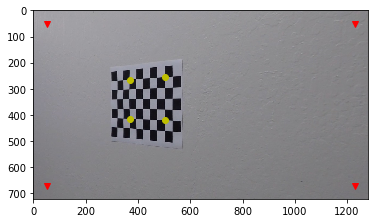
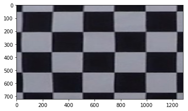
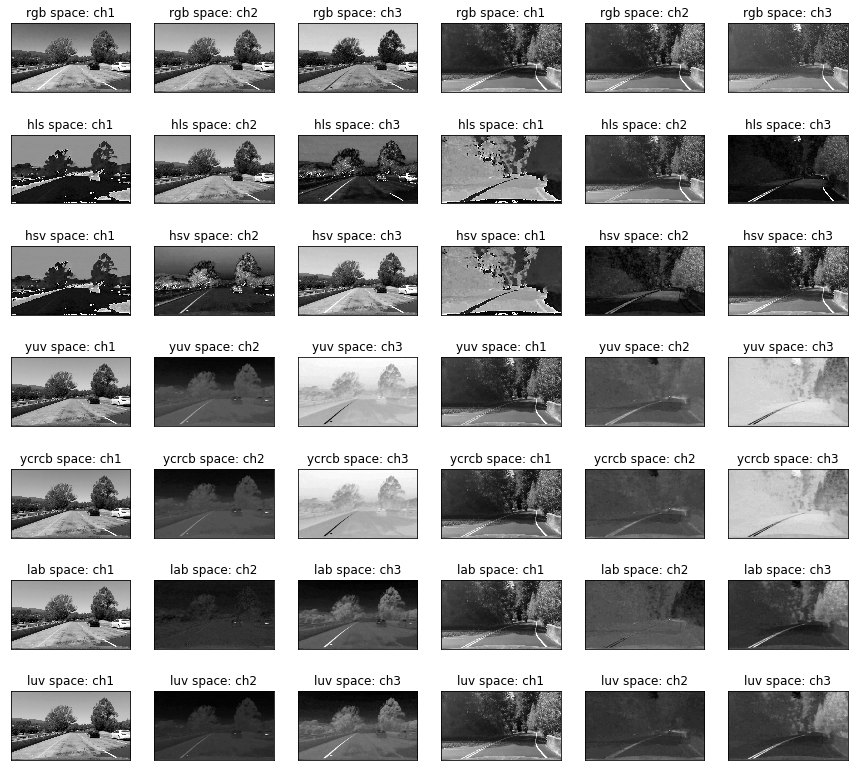
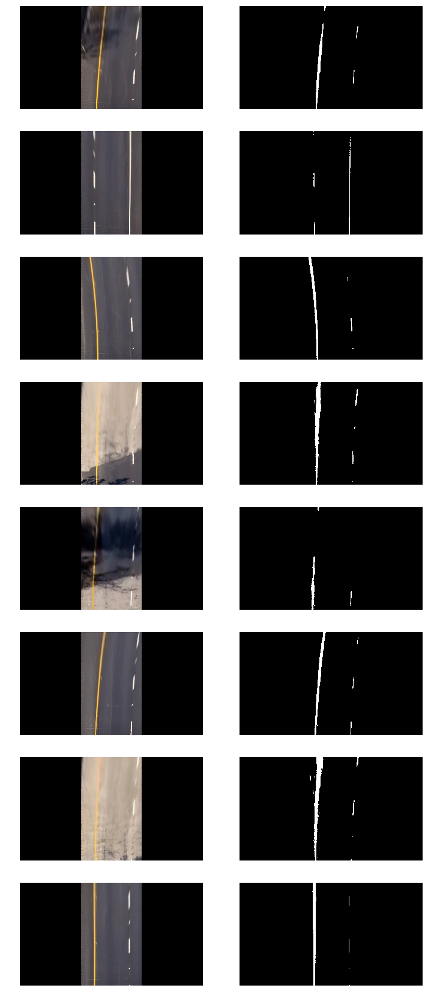
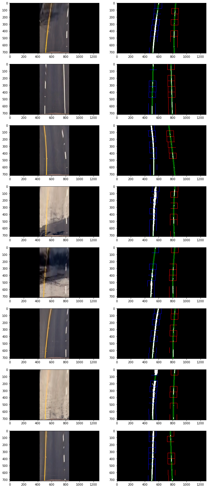
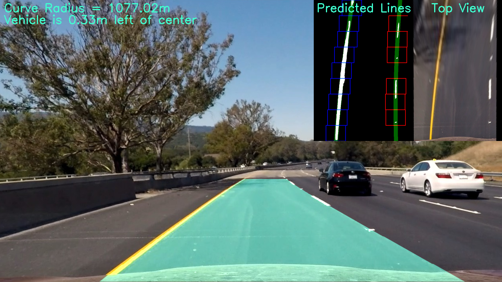
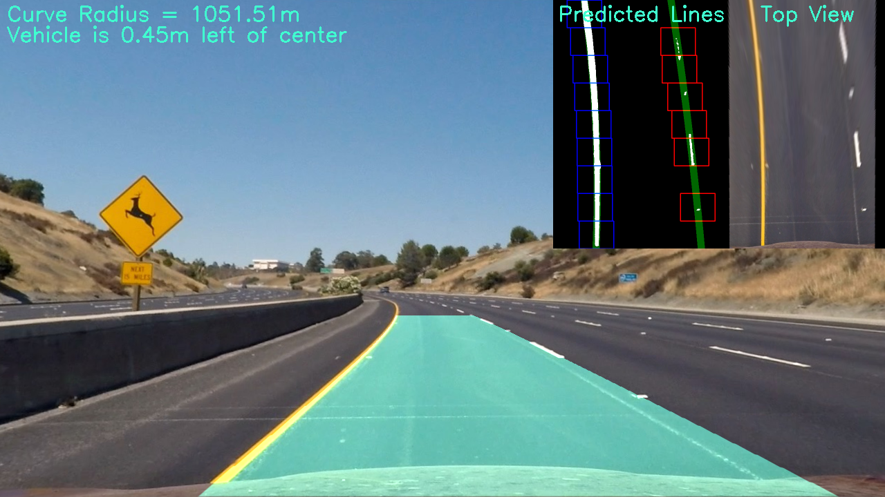
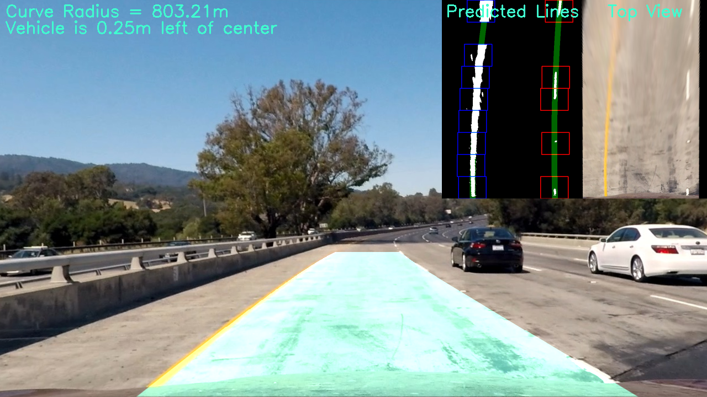

# Advanced Lane Finding Project

The aim of this project is to write a more robust lane line finding algorithm to deal with complex senarios like curving lines, shadows and changes in the color of the pavement.

While there is more sophisticated instruments like lidars and radars, for the task of perception, using the data from these kind of sensors is not economical. Using 2D camera images however, is cheaper and gives us more resolution and since the humans are capable of driving with even one eye, it should be possible to infer many of the world information, including the depth, using just the camera images.

On this poject, using only the camera images, we will focus on measuring how much is the line curving and where the vehicle is with respect to center of the lane.

## Sections

* **[Calibrating Image Distortions:](#calibrating-image-distortions)** A brief explanation is given about the math and how to calibrate a camera. Then, an image distortion correction function is implemented using [opencv](http://opencv.org/) library to correct the distortions on the raw images provided for the project.

* **[Perspective Transform:](#perspective-transform)** A viewpoint transform is demonstrated on a chessboard image given for camera calibration. Then, the implementation of bird's-eye viewpoint transformation of the road images is discussed.

* **[Thresholding Methods:](#thresholding-methods)** Gradient and color chresholding methods along with a final combined thresholding implementation is discussed.

* **[The Lane Finding Pipeline:](#the-lane-finding-pipeline)** The implementation of the lane search algorithm along with the helper functions that determines the lane pixels and finds the lane boundary to calculate the curvature radius of the lane and the position of the vehicle with respect to the center of the lane is duscussed.

* **[The Results:](#the-results)** After identifying the lane boundaries, the viewpoint tranformed back to original position and the results are demonstrated with the test images and the video footage.

* **[Possible Improvements:](#possible-improvements)** Possible issues and problems for harder cases and the possible improvements and solutions to these cases are discussed. 

All of the implemented code for the project is available and can be reached in [this notebook](./project-code.ipynb).

## Calibrating Image Distortions

Image distortions occur when transforming a 3D object to a 2D image due to type of lenses used by cameras. And this is an important issue when we would like to detect lane curvatures on video footages correctly.

The object being pictured has 3D coordinates P(X,Y,Z), however a pinhole camera transforms this information to form a 2D image p(x,y), just using a tranformative matrix called Camera matrix (C)

And when it is a camera with special lenses that taking pictures of 3D objects, the distortion usually can be captured by 5 numbers called distortion coefficients

### How to detect distortions

Distortions can be easily detected by taking pictures of the known shapes, such as a chessboard. Then knowing the distortion errors, the camera can be calibrated.

By taking multiple images of a chessboard on a flat surcase, we can detect the distortions by looking at the differences of size and shape of the squares (please see the function `camera_calibration_params`). Then a transform can be created to map distorted points to undistorted points. A raw chessboard image and the resulting distortion-corrected image are given below.

The image on the right is the result of the distortion correction.

### Distortion-corrected Test Images

By implementing a helper function (named `undistort`) for distortion correction, all of the test images are corrected and saved in the [output_images](./output_images) directory. The raw test images and the distortion-corrected resulting images are given below.

The images on the left are the raw images and on the right are the distortion-corrected results after calibrating the camera and applying distortion correction.

## Perspective Transform

An image gets smaller and smaller as it goes further away from the camera, and this phenomenon is known as perspective. Thus, in 2D images, parallel lines appear to converge to a point.

For example, as in the situation of an image of the road and the lane lines, the lane gets smaller as it gets further away from the camera. 

Mathematicly we can express this phenomenon as, in real world coordinates (X,Y,Z), greater the magnitude of an object's Z-coordinate, the smaller it will appear in an image.

A perspective transform uses this expression to transform an image by warping the image and dragging the points towards or pushing away from the camera.

Perpective transform (i.e. a bird's-eye view transform) is usefull, specifically, when the intention is to find the curvature of a lane.

To summarize, a perpective transform changes the perspective to view the same scene from different viewpoints and angles.

### Perspective Transform Using OpenCV

Selecting four points on an image is enough to define a linear transformation from one perspective to another. For this purpose a transformation is demonstrated on a chessboard image and implemented a perspective transformation function (`birds_eye_transform`) for later use.

The source points indicated with the yellow color are chosen from the automatically detected corners using `findChessboardCorners` function of the `opencv` library and these points are transformed to destination points which are indicated with the red color on the same image above. The resulting image below, demonstrates the result of the transformed viewpoint.

## Thresholding Methods

### Gradient Based Thresholding

Together with Hough line transformation, the Canny edge detection technique holds importance for detecting the lane lines. And the Canny edge detection algorithm is applied by Sobel operators. Sobel operation is a way of taking the derivative in the x or y direction.

A 3x3 sobel operator can be applied in the x or y directions,

for the x direction:

and for y direction:

These examples are Sobel operators of kernel size 3x3. A larger kernel size implies taking the gradient over a larger region of the image and results in a smoother gradient.

A sobel operation function named `multiple_edge_detection` is implemented combining multiple sobel operations to get a binary representation of an image. An original image (on the left) and the binary representation after the `multiple_edge_detection` function is applied (on the right) is given below (this image is provived by udacity in the project but not being a test image).

### Color Spaces and The Color Thresholding

When detecting the edges, since the images are converted to gray scales, the valuable color information gets lost. For instance, converting a road image to gray scale, especially when there is reflection on the road, it gets hard to detect the yellow lane lines. To overcome this problem, other kind of operations can be used. For example, converting the image to another color spaces like HLS (Hue-Saturation-Lightness) may help finding the yellow colored lines. Here in the HLS space, the lightness is the value that varies the most in different lighting conditions. And H and S channels are more consistent under shadow or brightness. Thus, using only the H and S channels in HLS space and discarding the L, the different colors of lane lines can be detected more reliably.

#### Exploration on different color channels

The lane detecting system should be robust to both shadow effects and reflections. for this purpose, various hard case images captured from the [challenge](challenge_video.mp4) and [harder challenge](harder_challenge_video.mp4) videos of the project to investigate the results for various color spaces. The captured images have reflection or shadow cases and perfect for investigating the results of reliability of invariant representations. The chosen hard case images are given below.

To compare the representations of hard case images in different color channels, `color_thresholding` and `compare_2img_color_thr` functions are implemented to convert the images from RGB to another color spaces.

At first, an image with sun reflecting on the road (the first image in hard case images) and an image with shadows on the road (the second image in hard case images) are chosen and investigated in various color spaces. The image with the reflection is represented on the first three columns for each of these columns is representing a color channel and the second image with the shadow is represented on the last three columns for each of these columns is again representing a color channel is given below.

The first three columns are the representations of three different channels (ch1, ch2, ch3) for the first image, and the last three columns are again the representations three channels (ch1, ch2, ch3) for the second image with each row representing a different color space. 

As can be seen from the results, some channels preserve and better represent the color information of the yellow lane lines in both conditions of reflection and shadow. To give an example, pixel information of the yellow lane line is well preserved with channel-3 (ch3) of LUV color space.

In addition, the information of white lane pixels are also well preserved with channel-3 in RGB space or channel-2 in HVS space. Thus a thresholding algorithm combining various color channels can be reliably used to detect the lane pixels.

#### The severe shadow cases

The representations of the third and the fourth images of the hard case images are given below in different color spaces to demonstrate how the line information is lost in severe shadow cases.

The first three columns are the representations of three different channels (ch1, ch2, ch3) for the first image, and the last three columns are again the representations three channels (ch1, ch2, ch3) for the second image with each row representing a different color space. These two images are from the harder challenge video captured in different times to demonstrate the lost information of the lane lines when the vehicle is passing under a bridge. Here in this case, the color loss is due to the reflecting light from other surrounding objects in severe shadow cases [(Ying et al., 2017)](https://arxiv.org/abs/1708.00975). An extra solution for the case is discussed and the results are demonstrated [here in this additional report](challenge-illuminant-invariance-solution.ipynb). 

#### Detecting lane pixels

For the purpose of detecting the lane pixels, a combined color thresholding function named `combined_color_thresholding` is implemented. In the implementation RGB, HSV and LUV color spaces are used to combine the thresholding results to get a resulting binary image of lane pixels. R channel in RGB space is used to get white lane pixels in an image with high values (the pixels within the range of 230 and 255 values are chosen). In addition, since [the project video](./project_video.mp4) does not have hard lighting conditions, it was enough to use the V channels from HSV and LUV spaces to detect the yellow colored lane pixels (the value range is 230 to 255 for HSV space and 157 to 255 for LUV space). Combining the results of the R channel from RGB and the V channels from HSV and LUV spaces, a binary output image is generated. For an extended solution to the severe shadow cases please visit [here](./challenge-illuminant-invariance-solution.ipynb).

The results on the test images are given below. The original test images with the bird's-eye view of the region of interest are given on the left and the resulting binary images with the lane pixels are given on the right.

As can be seen from the binary images on the right, in shadow cases, some low intensity valued lane pixels are lost. To avoid this, an additinaly generated binary image, thresholded between 185 and 230 intensity values in R channel, is used whenever this is the case.

## The Lane Finding Pipeline

Using the helper functions mentioned in the previous sections, a lane finding pipeline is implemented in a single function named `lane_detector`. The `lane_detector` function takes and BGR image as the input and processes this image in several steps to detect the lane lines, measures the radius of the lane curvature and the position of the vehicle with respect to the center of the lane and outputs a final image with the lane boundaries are identified. The steps of the pipeline are listed below,

* Takes a raw camera image as input (BGR image).
* Using camera matrix and the distortion coefficients, applies distortion correction to undistort the raw input image.
* Takes the lane area as the region of interest and transforms the viewpoint to bird's-eye view.
* Using combined color thresholding, detects the lane pixels and fits a second order polynomial to those pixel coordinates to predict the left and right lane lines.
* Measures the radius of the lane curvature and the position of the car with respect to the center of the lane.
* Colors the lane using the identified lane boundaries and transforms the viewpoint back to its original position.
* Outputs the resulting image.

The distortion correction, viewpoint transformation and the combined color thresholding methods are already mentioned in the previous sections. In the following subsections the lane line identification from the binary image and measuring the radius and the position are discussed in detail.

### Identifying left and right lane lines from the binary image

The binary image from the color thresholding is used to identify the lane pixels. For this purpose, the binary image is split horizontally into two parts of equal size. The left part is used to search for the left lane pixels and the right part is used to search for right lane pixels. To search the lane pixels in each part, sliding windows are used in the y direction. The number of sliding windows is controlled by a variable and nine is defined as the default value. If the number of detected pixels in a window is higher than 30, a histogtam of these pixels is taken along all the columns and the standard deviation of the histogram is measured. If the standard deviation is lower than 15.0, the pixels are considered as lane pixels. For the higher standard deviation values the pixels are considered as noise. These search operations are implemented in a helper function named `search_lane`. After all the lane pixels are identified on the binary image, the left and the right lane lines are predicted implementing a second order polynomial regression for each side. The name of the helper function predicting the lines is `fit_lane`.

The original test images and the resulting images with lane pixel detections and line predictions are given below. The original test images with the bird's-eye view of the region of interest is on the left and the resulting binary images are on the right. The detected lane pixels are shown with bounding boxes. The blue colored bounding boxes are for the left lane line pixels and the red bounding boxes are for the right lane line pixels. The white pixels in the binary images are the identified pixels with combined color thresholding and the green lines are the predicted lane lines with the second order polynomial regression.

### Measuring the radius and the position

[The formula](http://www.intmath.com/applications-differentiation/8-radius-curvature.php) for the radius of curvature at any point x for the curve y = f(x) is used to measure the radius of the lane curvatures. The regression data of the predicted lane lines are used seprately to measure the radius of the left and the right lane curvatures. To measure the radius values in meters, the lane distance is considered to be approximately 30 meters long with the width of the lane as 3.7 meters. Using the bird's-eye viewpoint, the quantities of meters per pixel in x and y dimensions are taken as 3.7/300 and 30/720 respectively. Using these quantites, the coefficients of the polynomial are recalculated in world space and using the previously mentioned radius formula the left and the right radius of the line curvatures are measured. Then the average of these two radius values are taken as the resulting radius of the lane curvature. 

For to measure the position of the vehicle, the midpoint of the two predicted lane lines is measured at the bottom of the image as being the reference point. Then the horizontal midpoint of the image is taken as the position of the vehicle and the distance between these two points is measured as the position of the vehicle with respect to the center of the lane.

All of the measurements mentioned above are implemented in the helper function `fit_lane`.

## The Results

### Results for the test images

After predicting the lane lines and measuring the radius and the position, as the final step of the pipeline, the lane is colored using the identified lane boundaries and drawn on the original image by transforming the viewpoint back to its original position. The resulting test images with identified lanes and measurements are given below.

### The project video

The pipeline is used along with the `moviepy` library to identify the lane of the vehicle in the project video. For the final video with the identified lane and the measurements please visit [here](https://youtu.be/WIe3X4WLmac).

## Possible Improvements

For generating a binary image by using the previously discussed combined color thresholding technique is enough to detect the lane pixels in normal lighting conditions. However, in hard lighting conditions like severe shadow cases, a [histogram equalization solution](./challenge-illuminant-invariance-solution.ipynb) is substantial for to obtain a robust lane detection pipeline based on illuminant invariance. An additional implementation of the histogram equalization solution to the pipeline will dramatically improve the results in hard lighting cases.

In addition, for the roads with lower curvature radii, lane lines may intersect with the midpoint of the image as it is the case for the [challenge video](./challenge_video.mp4) and the [harder challenge video](./harder_challenge_video.mp4). In this case, splitting the image in two equal parts horizontally may not be the right way for detecting the left and right lines accurately. Starting at the bottom of the image, an adaptive implementation by updating the midpoint of the lane with the previously detected left and right lane pixels and splitting the image with respect to this updates along with the y direction may be the solution for a better window search algorithm. This way, the horizontal length of the sliding windows will adapt to the curvatures and no lane intersections with the midpoint will happen.

For to detect the true lane pixels and separate the noise in binary images, in each sliding window, the histogram of the white pixels is taken along all columns, since a small standart deviation of this histogram was substantial to detect the clusters of true lane pixel. This implementation was enough for accurately detecting the lane lines in test images and the project video. However, for the images with harder lighting conditions, the noise increases. Thus, it gets harder to separate the true lane pixels by just using a histogram data. To avoid this, a deep learning approach can be implemented. The data of binary images with fine results can be augmented by adding noise and a convolutional neural network model can be trained on this dataset to detect the true lane pixels more bustly in noisy binary images.